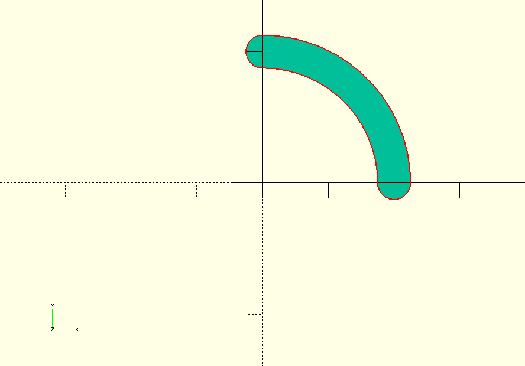

## arc.scad
Erstellt eine Nut mit Rundbohrer des Radius r auf einer Kreisbahn r2

    // 90 Grad Bogen
    nut_arc(90,20,2.5);

## mutter.scad
### DIN 934 Sechskantmuttern
Eine Sechskantmutter erstellt man mit dem module mutter(M) in mutter.scad:

      // M8 Mutter
      mutter(M=8);

# Quellen
* [Maße der Sechskantmuttern auf schrauben-lexikon.de](http://www.schrauben-lexikon.de/download/tiso_4032.pdf)
