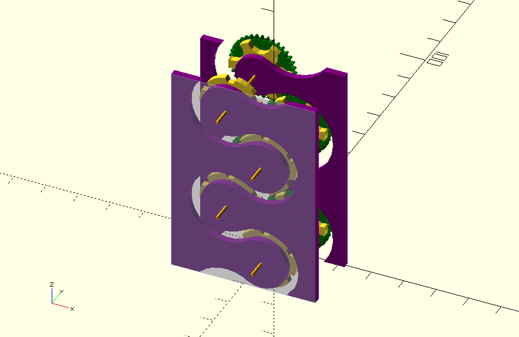

# MateTower
Dieses Projekt serviert neue Mateflaschen durch eine Rotation an der magischen Matekurbel. Alternativ arbeiten wir an einer Lösung durch einen Impuls nur eine Flasche auszugeben, ohne das eine Kurbel gedreht werden muss. (durch Gewichtskraft der Flaschen selbst)

## Barrel / Trommel

Barrels / Trommeln beschreibt die drehenden Einheiten. Sie bestehen aus Kreisen mit Öffnungen, die eine gewisse Anzahl an Flaschen aufnehmen und entlang der Transportroute zum nächsten Barrel übergeben.

## Führungsplatte

Holzplatten mit einer entsprechenden Nut, die die Flasche entlang der Föderroute führt.
Routendurchmesser:
* Flaschenbauch: d= 70mm
* Flaschendeckel d= 35mm

# Materialliste
* M8 Gewindestangen
[Bei Hornbach](http://www.hornbach.de/shop/Gewindestange-1-m-DIN-976-M8-galv-verzinkt/3831308/artikel.html)
* 10mm Hülsen (als Lager für Gewindestangen)
[Bei Hornbach](http://www.hornbach.de/shop/Rundrohr-Aluminium-silber-10-mm-2-m/736470/artikel.html)

# Zusammenbau
## Zahnräder
Müssen je um 2.5 Grad (Halber Zahnabstand) verdreht eingebaut werden, das alle Flaschenräder synchron laufen und trotzdem die zahnräder innereinander passen!

# Material:
* 12mm Siebdruckplatte
444 x 2000 mm

Arbeitsbereich Fräse:
Verfahrwege: X=720 mm; Y=420 mm; Z= 110 mm

# Modulbauweise
Um einzelne Module fräsen zu können, planen wir stabelbare Module, die mit folgenden Parametern erzeugt werden können:
## Parameter für 65cm Hohes 4-Stage Modul:
    $mate_r1 = 3.5;       //radius of bottle Body
    $mate_r2 = 1.75;      //radius of bottle neck

    $Barrel_r= 9.5;      //radius of one barrel / Trommel
    $Barrel_cap = 6;     //amount of bottles per barrel
    $Barrel_stages = 6;  //amount of barrels per tower
    $Barrel_distance = 19.5; //Barrel Distance (Gear mid radius)

    $Barrel_offset = 33.556;  //Barrel offset in degrees!

    $Tower_width = 44.4;
    $Tower_height = 65;

[Hier als 3D Modell](docu/Modul-4Stage.stl)
